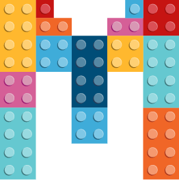

<div align="center">
  <!-- replace with accurate logo e.g from https://worldvectorlogo.com/ -->
  
  </a>
  <h1>mete-cli</h1>
</div>

[](https://www.npmjs.com/package/mete-cli) [](https://npm-stat.com/charts.html?package=mete-cli) [](https://github.com/GoDotDotDot/mete-cli/releases)

Universal front-end cli, we just support react enviroment now.

## Features

- Dynamic Import
- Code Splitting
- i18n
- Decorator Support

## TODO:
- 自动安装缺失依赖
- 打开浏览器窗口
- 自动选择端口
- 升级postcss-prese-env
- 升级browserlist 到3

## Getting Started

### Installation

```shell
$ npm install -g mete-cli
```

### Usage

1. Create an new project

```shell
$ mete init my-app
```

2. Start in development 

```shell
$ mete dev
```

### Development Environment

Before starting your project, you should run `mete dll` for building dll files! Otherwise, you will get the following error message.

```shell
The following Webpack DLL manifest is missing: react_vendor_manifest.json
Expected to find it in /Volumes/Mac2/CHUKUI/PROJECTS/mete-boilerplate/dll
Please run: mete dll
```

```Shell
$ mete dev
```

### Production Environment

waiting...

### DLL Build

```shell
$ mete dll
```

### Gennerator

We provide some code template for coding quickly.

Just use

```shell
$ mete generate
```
if something ok, you will see the list of generators.

## Project Structure


